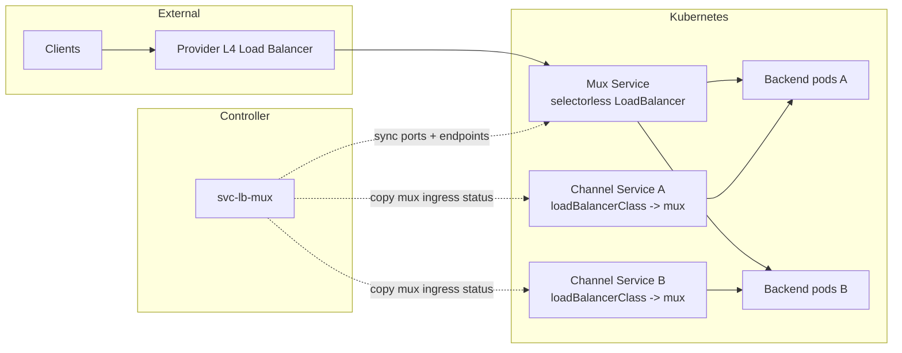

# Service LoadBalancer Multiplexer

[](https://github.com/nowakeai/svc-lb-mux/actions/workflows/ci.yml)
[](https://github.com/nowakeai/svc-lb-mux/pkgs/container/svc-lb-mux)
[](LICENSE)

Service LoadBalancer Multiplexer, or `svc-lb-mux`, is a Kubernetes controller that lets many application-facing `LoadBalancer` Services share one provider-managed Layer 4 load balancer.

It is built for teams that expose many TCP/UDP services and want to keep the Kubernetes Service workflow while reducing cloud load balancer count, provisioning time, quota pressure, and recurring cost.

## Why It Exists

Kubernetes makes external L4 exposure simple with `type: LoadBalancer`, but the default cloud-provider behavior is usually one cloud load balancer per Service. That model gets expensive and operationally awkward when a cluster has many small Services, many externally reachable ports, or quota-constrained environments.

`svc-lb-mux` keeps the familiar Service abstraction and consolidates the cloud-facing load balancer layer:

- **Fewer cloud load balancers**: one mux Service can front many channel Services.
- **Lower cost surface**: reduce duplicate provider L4 load balancers for compatible workloads.
- **Less quota pressure**: stretch limited forwarding rule, IP, and load balancer quotas.
- **Kubernetes-native operations**: use Services, annotations, Helm, events, Endpoints, and GitOps ignore rules.
- **No cloud IAM dependency for the normal path**: on GKE, forwarding rules and firewall rules remain GKE-managed.
- **Stable port ownership**: channel port claims and automatic assignments are persisted per mux in a controller-owned ConfigMap.

## Concepts

The naming comes from electronic multiplexers: many input channels are carried through one shared output path.

- **Mux**: a selectorless `LoadBalancer` Service that owns the shared provider L4 load balancer.
- **Channel**: an application-facing `LoadBalancer` Service that points at a mux through `spec.loadBalancerClass`.



The mux Service name does not have to be `mux`. A common production pattern is one mux per namespace or project, using a semantic name such as `payments`, `rollup-p2p`, or simply `mux` within each namespace.

## Provider Status

| Provider | Status | Notes |
| --- | --- | --- |
| GKE | Actively validated | Default chart values target GKE external passthrough Network Load Balancers. One mux is capped at 100 Service ports to stay inside GKE-native behavior. |
| EKS | Supported guide | AWS NLB setup is documented; provider-specific validation should be repeated in your environment. |
| Other Kubernetes providers | Experimental | The core model is Kubernetes-native, but provider load balancer behavior varies. |

## Quick Start

Builds from this repository publish images and Helm charts to GHCR. Install the Helm chart from the OCI registry:

```console
helm install svc-mux oci://ghcr.io/nowakeai/charts/svc-lb-mux \
  --version 0.1.0 \
  --namespace svc-mux \
  --create-namespace
```

The default chart creates a mux Service named `mux` in namespace `svc-mux`. These are defaults, not requirements.

The default API prefix is `svc-mux.nowake.ai`:

```yaml
api:
  prefix: svc-mux.nowake.ai
```

Set `api.prefix` in your values file if your organization needs a different prefix. The controller uses this prefix for annotations, finalizers, and `loadBalancerClass` references.

For a complete first install and validation flow, see [docs/getting-started.md](docs/getting-started.md).

## Default Mux Values

The chart defaults are conservative for GKE:

```yaml
defaultLoadBalancer:
  create: true
  name: mux
  annotations:
    cloud.google.com/l4-rbs: "enabled"
  loadBalancerClass: ""
  allocateLoadBalancerNodePorts: true
  portRange: "20000-20099"
  maxPorts: 100
  allocationConfigMapName: ""
```

For production GKE installs, see [docs/gke-lb-setup.md](docs/gke-lb-setup.md), including static IP binding, the GKE 100-port mux limit, GKE forwarding rule port behavior, generated Google Cloud resources, and validation commands. For AWS, see [docs/aws-nlb-setup.md](docs/aws-nlb-setup.md).

## Create A Channel Service

A channel Service keeps `type: LoadBalancer`, but points at a mux instead of asking the cloud provider for a new load balancer.

```yaml
apiVersion: v1
kind: Service
metadata:
  name: my-service
  namespace: my-namespace
spec:
  type: LoadBalancer
  loadBalancerClass: svc-mux.nowake.ai/mux.svc-mux
  allocateLoadBalancerNodePorts: false
  selector:
    app: my-app
  ports:
    - name: http
      port: 80
      targetPort: 8080
```

Rules:

- `spec.loadBalancerClass` is `<api-prefix>/<mux>[.<namespace>]`.
- Every channel port must have a stable name.
- Channels normally set `allocateLoadBalancerNodePorts: false`; the mux owns the provider-facing load balancer ports.
- By default, the channel Service port is used as the external mux port.

If the desired public mux port is the same as the channel Service port, set
`spec.ports[].port` directly and do not add `external-ports`. For the full port
model, see [docs/channel-services.md](docs/channel-services.md).

To expose a different external mux port, use `external-ports`:

```yaml
metadata:
  annotations:
    svc-mux.nowake.ai/external-ports: "http:8080,https:8443"
```

To let the mux allocate from its port pool:

```yaml
metadata:
  annotations:
    svc-mux.nowake.ai/external-ports: "http:auto"
```

Automatic assignments are stored in one ConfigMap per mux. This keeps mappings stable across controller restarts and GitOps re-application without coupling unrelated muxes to the same state object.

## GitOps

The controller owns the mux Service runtime `spec.ports` because that list is derived from active channels. If GitOps manages mux Services, configure it to ignore mux `spec.ports`; otherwise GitOps and the controller will continuously overwrite each other.

See [docs/gitops.md](docs/gitops.md) for Argo CD and Flux examples.

## Debug UI

The debug UI is **WIP** in this release. It is useful for basic state and topology inspection, but the product surface, plugin model, security hardening, and advanced diagnostics still need more work. It is enabled by default on port `8080` and requires a token by default. Helm generates a Secret if no token is provided. Mutating debug actions are disabled unless explicitly enabled.

```console
kubectl get secret -n svc-mux svc-mux-debug-token -o jsonpath='{.data.token}' | base64 -d
kubectl port-forward -n svc-mux deployment/svc-mux 8080:8080
```

Open <http://localhost:8080> and use any username with the token as the password.

## TODOs

Important follow-up work before treating `svc-lb-mux` as a broadly complete product:

- **Debug Web UI**: rebuild the WIP UI into a modular, production-oriented operator console with clearer topology views, safer authentication and authorization, audit-friendly actions, and extensible diagnostics.
- **Debug plugins**: move protocol-specific diagnostics into opt-in plugins, starting with workloads such as `devp2p`, so the core controller stays provider- and protocol-neutral.
- **EndpointSlice support**: add EndpointSlice aggregation alongside the current Endpoints path, with readable generated resources and better scaling characteristics for large channel sets.
- **GitOps hardening**: continue reducing controller/GitOps drift risk, especially around generated mux ports, mux state, status fields, and provider-managed annotations.
- **Provider validation**: expand repeatable pressure tests and compatibility reports for GKE, EKS, and additional Kubernetes providers.

## Documentation

Start with the [documentation map](docs/README.md) if you are not sure which guide to read.

- [Getting started](docs/getting-started.md)
- [Channel Service manual](docs/channel-services.md)
- [Tutorials and common cases](docs/tutorials.md)
- [Troubleshooting](docs/troubleshooting.md)
- [GKE LoadBalancer setup](docs/gke-lb-setup.md)
- [AWS NLB setup](docs/aws-nlb-setup.md)
- [GitOps compatibility](docs/gitops.md)
- [Controller design and features](docs/controller.md)
- [Roadmap](ROADMAP.md)

## Development

```console
make check-lock
make lint
make template
make python-compile
make test
make docker-build
```

Dependency metadata lives in `pyproject.toml`; exact runtime dependencies are locked in `uv.lock`. The container installs dependencies with `uv sync --locked`, so `uv.lock` is the source of truth.

## Community

Service LoadBalancer Multiplexer is maintained under the nowake.ai GitHub organization for open cloud-native infrastructure work. Contributions, provider validation reports, documentation fixes, and operational feedback are welcome.

- Read [CONTRIBUTING.md](CONTRIBUTING.md) before opening a pull request.
- Read [SECURITY.md](SECURITY.md) for vulnerability reporting.
- Read [SUPPORT.md](SUPPORT.md) for support expectations.
- This project is licensed under [Apache License 2.0](LICENSE).
